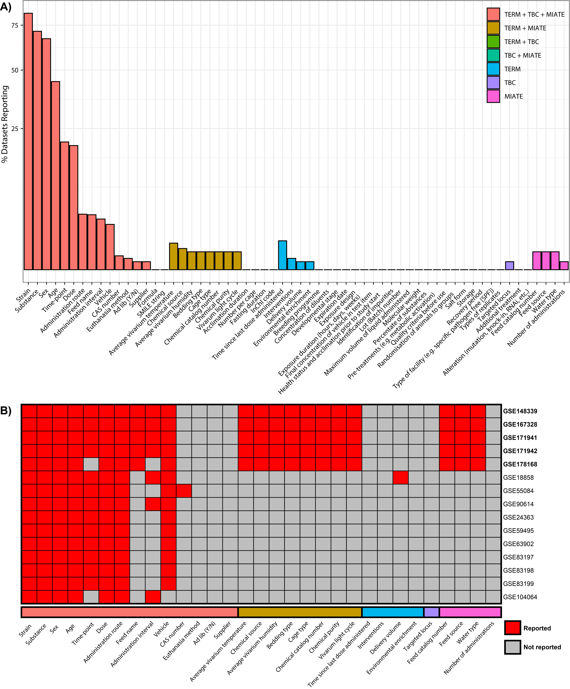

<h1 align="center">
  <br/>
  Minimum Information about Animal Toxicology Experiments Resources
</h1>

The <b>M</b>inimum <b>I</b>nformation about <b>A</b>nimal <b>T</b>oxicology <b>E</b>xperiments (MIATE) is a suite of resources developed to 
facilitate the standardized collection of _in vivo_ toxicology experimental data and promote the <b>F</b>indable, <b>A</b>ccessible, <b>I</b>nteroperable, <b>R</b>eusable 
(FAIR) principles for _in vivo_ animal toxicology experiments.

MIATE aims to be a community-driven set of minimal metadata requirements for animal toxicology experiments supported by a templates, protocols, and resources 
to enable collection of research data in a standardized manner. Your feedback is welcome. Simply open a new 
issue and tell us your suggestions and/or comments. You can also [contact us](mailto:zacharewski.lab@gmail.com)

# Table of Contents
* [MIATE Checklist](#Checklist)
* [Using MIATE](#Templates)
	* [CEDAR](#CEDAR)
	* [GEO](#GEO)
	* [ISA](#ISA)
* [Examples](#Examples)
* [Tools](#Tools)
	* [Comparison of reporting standards](#RScomparison)
	* [Evaluation of GEO metadata](#GEOeval)
	* [Integration of ISA configurations](#ISAmerge)

<a name = "MIATE Checklist"/><h3>MIATE Checklist overview</h3>
==========================================
The MIATE reporting standards can be viewed in [pdf](https://github.com/zacharewskilab/MIATE/raw/master/checklist/MIATE-Checklist.pdf), [tab-delimited](https://github.com/zacharewskilab/MIATE/blob/master/checklist/MIATE-Checklist.txt), 
and [MS Excel](https://github.com/zacharewskilab/MIATE/raw/master/checklist/MIATE-Checklist.xlsx) formats. 


<a name = "Templates"/><h3>How to use MIATE</h3>
==========================================
The MIATE reporting standard leverages existing data collection tools from the [ISAcommons](https://www.isacommons.org/), [Center for
Expanded Data Annotation and Retrieval](https://metadatacenter.org/), and [Gene Expression Omnibus](https://www.ncbi.nlm.nih.gov/geo/info/submission.html).
Templates have been generated for individual platforms in the aim to reduce the barrier for researchers to collect data in accordance with these minimal requirements.

<a name = "CEDAR"/><h3>CEDAR</h3>
MIATE has been implemented as a [CEDAR template](https://openview.metadatacenter.org/templates/https:%2F%2Frepo.metadatacenter.org%2Ftemplates%2Fa1d0f86f-395f-4ad6-b320-09189329250f). To use the template:
	1. Login to [CEDAR workbench](https://cedar.metadatacenter.org/)
	2. Search in the "Shared with Everybody" tab for "MIATE-Investigation" 
	3. Using the three points for more options choose "populate". This will make a copy in your own workspace.
	4. populate the template and save.
  
<a name = "GEO"/><h3>GEO</h3>
For more information the Gene Expression Omnibus (GEO) [click here](https://www.ncbi.nlm.nih.gov/geo)

<a name = "ISA"/><h3>Investigation, Study, Assay (ISA) Configurations</h3>
_Deprecated_: The ISA framework was developed to standardize the collection, curation, management, and reuse of life science data. While MIATE is developed based on the ISA framework 
detailed [here](https://isa-specs.readthedocs.io/en/latest/), ISAcreator is no longer maintained [Github](https://github.com/ISA-tools).


<a name = "Examples"/><h2>Examples</h2>
==========================================
To demonstrate the use, structure, and formatting we compiled the same experiments using all three templates. In short, the experiment study design
consisted of a dose-response exposure to the aryl hydrocarbon receptor (AHR) agonist in male C57/BL6Crl mice gavaged every 4 days for 28 days. 

<a name = "Tools"/><h2>Tools</h2>
==========================================
<a name = "RScomparison"/><h3>Comparison of reporting standards</h3>
An [excel spreadsheet](TERM_TBC_MIATE_Comparison_040622.xlsx) outlines the comparison of terms described in the [ToxBio Checklist](https://pubmed.ncbi.nlm.nih.gov/17442663/), the [OECD Toxicology
Experiment Reporting Module (TERM)](https://pubmed.ncbi.nlm.nih.gov/34333066/) and MIATE. 


<a name = "GEOeval"/><h3>Evaluation of GEO metadata</h3>
A case study demonstrating the value of using a structured metadata collection tool is shown for environmental health sciences data deposited in GEO. Detailed 
methodology can be found [here](https://github.com/zacharewskilab/MIATE/tree/master/Tools/GEOQuery)


<a name = "ISAmerge"/><h3>Integration of ISA configurations</h3>

<a name = "Contributing"/><h2>Contributing</h2>
To be added

<a name = "Citing"/><h2>Citing MIATE resources</h2>
Please cite ["Submitted"][paper]

```
@article{,
   author = {Nault, Rance and Zacharewski, Tim},
   title = {TBD},
   journal = {TBD},
   pages = {TBD},
   DOI = {TBD},
   url = {TBD},
   year = {TBD},
   type = {Journal Article}
}
```

[paper]: https://www.biorxiv.org/