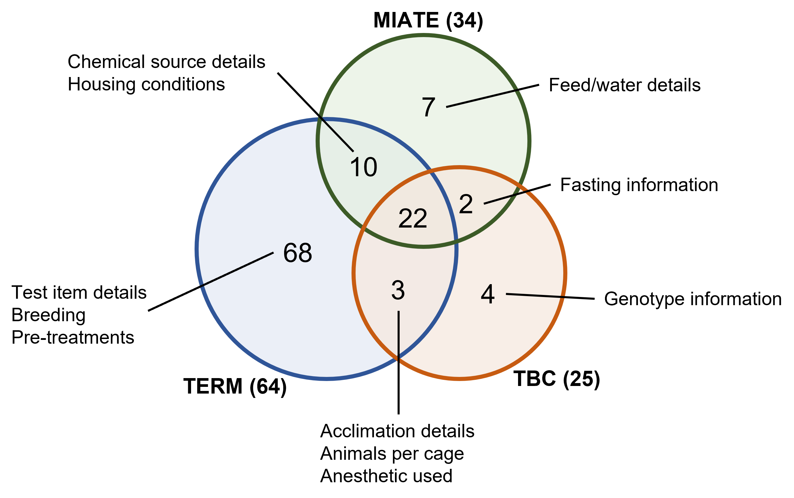

<h1 align="center">
  <br/>
  Minimum Information about Animal Toxicology Experiments Resources
</h1>

The Minimum Information about Animal Toxicology Experiments (MIATE) github resources is a suite of documents to 
assist in the use and evaluation of MIATE to promote the <b>F</b>indable, <b>A</b>ccessible, <b>I</b>teroperable, <b>R</b>reusable 
(FAIR) principles for _in vivo_ animal toxicology experiments.

The aim of MIATE is to be a community developed set of minimal metadata requirements. Your feedback is welcome. Simply open a new 
issue and tell us your suggestions and/or comments. You can also [contact us](mailto:zacharewski.lab@gmail.com)

# Table of Contents
* [MIATE Checklist](#Checklist)
* [Templates](#Templates)
	* [ISA](#ISA)
	* [CEDAR](#CEDAR)
	* [GEO](#GEO0)
* [Examples](#Examples)
* [Tools](#Tools)
	* [Comparison of reporting standards](#RScomparison)
	* [Evaluation of GEO metadata](#GEOeval)
	* [Integration of ISA configurations](#ISAmerge)

<a name = "Checklist"/><h2>Checklist</h2>
==========================================
The MIATE reporting standards is provided in [pdf](https://github.com/zacharewskilab/MIATE/raw/master/checklist/MIATE-Checklist.pdf), [tab-delimited](https://github.com/zacharewskilab/MIATE/blob/master/checklist/MIATE-Checklist.txt), and [MS Excel](https://github.com/zacharewskilab/MIATE/raw/master/checklist/MIATE-Checklist.xlsx) formats as reference. The current version includes requirements for 
_in vivo_ animal experiments and includes early drafts for _in vitro_ and _ex vivo_ toxicological experiments which have not been formalized into
templates. 


<a name = "Templates"/><h2>Templates</h2>
==========================================
Here the MIATE reporting standard is implemented as templates for three commonly used resources for the collection of 
(meta)data. For more information on these formats please see the [ISAcommons](https://www.isacommons.org/), [Center for
Expanded Data Annotation and Retrieval](https://metadatacenter.org/), and [Gene Expression Omnibus](https://www.ncbi.nlm.nih.gov/geo/info/submission.html).

<a name = "ISA"/><h3>Investigation, Study, Assay (ISA) Configurations</h3>
The ISA framework was developed to standardize the collection, curation, management, and reuse of life science data. For more information about the ISA 
Commons community of users [click here](https://www.isacommons.org/). The ISA framework is detailed [here](https://isa-specs.readthedocs.io/en/latest/). 
For ISA related tools and resources visit their [Github](https://github.com/ISA-tools).

<a name = "CEDAR"/><h3>CEDAR</h3>
For more information about the Center for Expanded Data Annotation and Retrieval (CEDAR) [click here](https://metadatacenter.org/).

<a name = "GEO"/><h3>GEO</h3>
For more information the Gene Expression Omnibus (GEO) [click here](https://www.ncbi.nlm.nih.gov/geo)

<a name = "Examples"/><h2>Examples</h2>
==========================================
To demonstrate the use, structure, and formatting we compiled the same experiments using all three templates. In short, the experiment study design
consisted of a dose-response exposure to the aryl hydrocarbon receptor (AHR) agonist in male C57/BL6Crl mice gavaged every 4 days for 28 days. 

<a name = "Tools"/><h2>Tools</h2>
==========================================
<a name = "RScomparison"/><h3>Comparison of reporting standards</h3>
An excel spreadsheet outlines the comparison of terms described in the [ToxBio Checklist](https://pubmed.ncbi.nlm.nih.gov/17442663/), the [OECD Toxicology
Experiment Reporting Module (TERM)](https://pubmed.ncbi.nlm.nih.gov/34333066/) and MIATE. 


<a name = "GEOeval"/><h3>Evaluation of GEO metadata</h3>
A case study demonstrating the value of using a structured metadata collection tool is shown for exposure studies deposited in GEO. The code and documentation
for reproducing published findings are included here.

<a name = "ISAmerge"/><h3>Integration of ISA configurations</h3>

<a name = "Contributing"/><h2>Contributing</h2>
To be added

<a name = "Citing"/><h2>Citing MIATE resources</h2>
Please cite ["Submitted"][paper]

```
@article{,
   author = {Nault, Rance and Zacharewski, Tim},
   title = {TBD},
   journal = {TBD},
   pages = {TBD},
   DOI = {TBD},
   url = {TBD},
   year = {TBD},
   type = {Journal Article}
}
```

[paper]: https://www.biorxiv.org/