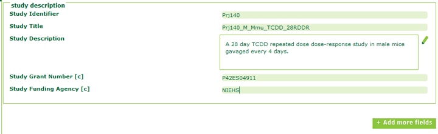

<h1 align="center">
   
  Minimum Information about Animal Toxicology Experiments Resources
</h1>

The Minimum Information about Animal Toxicology Experiments (MIATE) github resources is a suite of documents to 
assist in the use and evaluation of MIATE to promote the <b>F</b>indable, <b>A</b>ccessible, <b>I</b>teroperable, <b>R</b>reusable 
(FAIR) principles for _in vivo_ animal toxicology experiments.

==========================================

## Table of Contents
==========================================
* [ISA-MIATE Background](#background)
* [ISA-MIATE Data Model](#datamodel)
* [Getting Started with ISA-MIATE](#getstarted)
* [Populating ISA MIATE Investigation](#populate)
	* [Study description](#desc)
	* [Study assays](#assays)
	* [Study design descriptors](#descriptors)
	* [Study publications](#pubs)
	* [Study factors](#factors)
* [Populating ISA MIATE Study](#studysection)	

<a name = "background"/>ISA configuration for Toxicology Studies
==========================================

Give some background information on ISA, why, how, etc..

[ISA](https://isa-specs.readthedocs.io/en/latest/isatab.html)

<a name = "getstarted"/> Getting Started with ISA for Toxicology Studies
==========================================
1. <b>Download</b> the latest version of ISAcreator from the [ISA-tools software suite](https://isa-tools.org/software-suite.html) and extract files.
2. <b>Download</b> MIATE Configurations 
	<i>2.A.</i> Using git clone 
		<i>2.B.</i> By downloading using the download icon. Save the folder in a location you will remember.

3. Run the <b>ISAcreator.jar</b> file. Select <b>ISAcreator Light</b>. 

4. Create a new profile.

5. <b>Login</b> using newly created or existing user profile. You will be directed to a configuration loading page. Select <b>"Open another..."</b>.

6. **Select the MIATE isaconfigs folder**. 

7. Select the first choice <b>"create new experiment description"</b>. Then select <b>"create manually"</b>.

8. Select the green  button to create a new Investigation/Study. Assign it a <b>unique Identifier</b>.

| **Section**                  | **Description**                                                                                                               |
| ---------------------------- | ----------------------------------------------------------------------------------------------------------------------------- |
| **Study Description**        | Here you will enter the major details of the study                                                                            |
| **Study Assays**             | This is where you will add relevant assays such as RNA-sequencing, metabolomics, clinical chemistry, etc...                   | 
| **Study Design Descriptors** | You can select ontologies which describe your experimental design (e.g. EFO: dose response design)                            | 
| **Study Publications**       | Enter any relevant details regarding publications related to the study data                                                   | 
| **Study Factors**            | Here you can list the factors which were manipulated in the study                                                             | 
| **Study Protocols**          | Provide a description of how the experiment was performed, as well as all protocols related to the assays which will be added | 
| **Study Contacts**           | Enter contact information for researchers involved in the study                                                               | 

Populating the ISA configuration
==========================================
<a name = "desc"/>
9. Complete the **Study Description** section (see example below). Note that all fields are required. Additional funding or other relevant details can be added using the  button. 

<a name = "assays"/>
10. In the **Study Assays** section, select **add new assay(s)**. Add the appropriate assay details. Note: Only RNA-seq is currently developed.

<a name = "descriptors"/>
11. In the **Study Design Descriptors** section, add ontology terms which are representative of the study's design (e.g. EFO: dose response, IOBC: Toxicity tests, subchronic). You can include as many or as little as necessary. 
	11.a. To add a term **double-click** on the empty field to open the **ontology search tool**. 
	11.b. Search for your term and add it as a descriptor as shown in the figure below. 

    11.c. Click on the  button to add more fields as necessary.

<a name = "pubs"/>
12. Complete the **Study Publications** section. If the study is not published, this can be left to a later point. *Note: the "search for publication" does not work in version 1.7.11*.

**NOTE: Remember to save your progress**

<a name = "factors"/>
13. Add appropriate **Factors** to the **Study Factors** section. These will be pre-populated based on MIATE requirements. **Adding a factor will not automatically add it to the study table. Be sure to add the column (see step #X).**

14. **Protocols** are populated based on your study and assays. 

| **Source**        | **Name**                        | **Description**                                                                                                             |
| ----------------- | ------------------------------- | --------------------------------------------------------------------------------------------------------------------------- |
| **Study**         | **Treatment**                   | Describe the study design, housing conditions, and treatment protocols for the study                                        |
| **RNA-seq assay** | **library preparation**         | Describe how sequencing libraries were prepared starting from extraction of the RNA to sequencing.                          | 
| **RNA-seq assay** | **nucleic acid sequencing**     | Describe the sequencing design such as distribution in flow cells, read depth, etc...                                       | 
| **RNA-seq assay** | **analysis and transformation** | Describe how the RNA-seq reads were analysed from genome alignment to normalization and differential expression analysis    |    
	
It is strongly recommended that users consider placing their protocols in a searchable repository and link it in the **Study Protocol URI** line. For example, a protocol coult be developed in [protocols.io](https://www.protocols.io/) where it can be queried by reagents and other appropriate metadata.

<a name = "studysection"/> Populating the **Study Section**
==========================================

15. Select the s_{study id} in the **isatab overview**. This will display a table to populate study details.

16. Add all relevant data in the table columns. **Tips & Tricks**:
	* Selecting and hovering over a column name will give you some additional information
	* Data can be copied and pasted from an excel spreadsheet except for those requiring ontologies
	* Use the buttons at the top to perform certain tasks
	
	* See [below](#definitions) for definitions

For more details on the required fields please see the **[MIATE Checklist](checklist/MIATE-Checklist.pdf)**.

17. **Add additional columns as necessary**. Examples may include:
* **Parameter[Zeitgerber time]**: The time relative to the end of the dark cycle at which samples were collected.

<a name = "transcriptomicassaysection"/> Populating the **Transcriptomic Assay**
==========================================

NN. **Add additional columns as necessary**. Examples may include:
* **Characteristic[liver lobe]**: The lobe from which the RNA was isolated for transcriptomics.
* **Parameter[code repository]**: A link to the github repository with the code for the analysis.

<a name = "definitions"/> Definitions
==========================================	
For more definitions and details, [click here](https://isa-specs.readthedocs.io/en/latest/isamodel.html)

* **Parameter**: Reporting on the values taken by parameters when applying a protocol. A protocol description in the Study SHOULD declare the required parameters, where here the values applied are recorded.

* **Characteristic**: A list of material characteristics that may be qualitative or quantitative in description. Qualitative values MAY be Ontology Annotations, while quantitative values MAY be qualified with a Unit definition.

* **Factor**: A factor corresponds to an independent variable manipulated by the experimentalist with the intention to affect biological systems in a way that can be measured by an assay. 